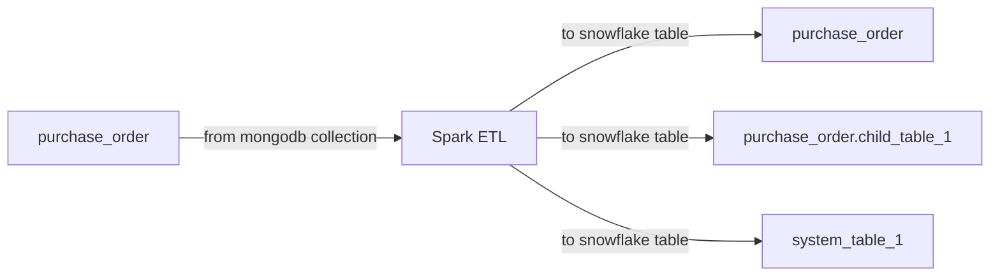

Steps to use this code:

1. Install the python packages by using requirements.txt
2. Run the table_creation.py file to create necessary table in snowflake
3. Run analytics_migration_etl.py to analysis the transformation

PS: Provide the necessary snowflake connection parameters value 
in table_creation.py and analytics_migration_etl.py

Example data folder:

migration_poc/example_data path has two folder input and output

 input folder:
   Represent a single collection in mongodb 
   1. purchase_order 

 output folder:
   Represents snowflake tables. After extraction and transformation applied, the purchase_order into three table
in snowflake

  1. purchase_order (parent table)
  2. purchase_order.child_table_1 (child table)
  3. system_table_1 (system table)
   

